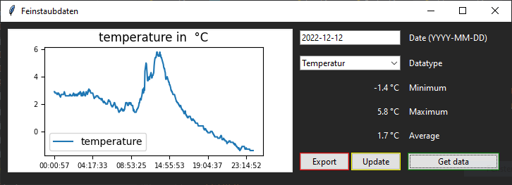

# Feinstaubstation

## The Userinterface
This is a programm to get the pollution, temperature and humidity from one day in Bochum.



You can select one day and the datatype you want to show.<br>
Click on "Export" to export and open the shown data as a PDF file.<br>
Click on "Update" to get the latest data from the database.

## How to install dependencies?

If you want to run the code directly you need to install the dependencies from the requirements.txt file 
with the following command:
```bash
py -m pip install -r requirements.txt
```
